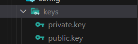

# LyokoHub 

## **本项目结合 ESModule 和 TypeScript 实现一个基于 NodeJS 开发的平台**

**注意！linux和mac用户需选取mac/linux分支，或者在main分支下进行以下配置的修改方可正常使用：**

```shell
pnpm install ts-node -D
```

**package.json**

```json
   "dev": "nodemon --watch /src/**/* --delay 500ms -e ts --exec npm start",
    "start": "node --loader ts-node/esm -r esbuild-register src/main.ts",
```

**/src/router/index.ts**

```typescript
    const router = routerModule.default.default; // 获取默认导出
```

### 必须配置项：

**服务器和mysql数据库配置**

请在本地创建.env文件，自主配置相关服务器和mysql配置，示例文件内容如下：

```
SERVER_HOST=您的服务器HOST，本地可配置为 http://localhost
SERVER_PORT=您的服务器接口
MYSQL_HOST=您的数据库HOST，本地可配置为 localhost
MYSQL_PORT=您的数据库接口
MYSQL_DATABASE= 您的数据库名称
MYSQL_USER= 您的数据库用户名称
MYSQL_PASSWORD=您的数据库密码
```

**使用公钥和私钥签发和验证签名**

在config文件夹下建立keys文件夹

基于openssl生成公钥和私钥：

```shell
openssl
> genrsa -out private.key 1024
> rsa -in private.key -pubout -out public.key
```

将生成的公钥和私钥添加进对应文件夹即可



### 本项目引用插件：

husky+commitizen

利用 husky 和 commitizen 保证项目的注释规范

@typescript-eslint/eslint-plugin@latest

利用 eslint 规范 typescript 代码

dotenv

用于实现全局环境变量的定义和引用

esbuild-register

用于在 Node 环境中运行 TypeScript 代码

@types/koa @types/koa-router @types/koa2-cors
@types/koa-bodyparser

用于在 Koa 中使用 typescript

koa-router

用于在 ESModule 中使用 Koa-router

nodemon

使用 nodemon 实时更新 Node 的同步刷新

### 具体实现：

pnpm install commitizen -D

pnpx commitizen init cz-conventional-changelog --pnpm --save-dev --save-exact

pnpm install @typescript-eslint/eslint-plugin@latest --save-dev

pnpm i -D esbuild-register

pnpm i --save-dev @types/koa @types/koa-router @types/koa2-cors
@types/koa-bodyparser

pnpm install koa-router --save

### 目录结构：

|-- LyokoHub
|-- .env
|-- .eslintrc.js
|-- .gitignore
|-- package.json
|-- pnpm-lock.yaml
|-- readme.md
|-- tsconfig.json
|-- .husky
| |-- pre-commit
| |-- \_
| |-- .gitignore
| |-- husky.sh
|-- src
|-- main.ts
|-- config
| |-- server.ts
|-- router
|-- user.router.ts

## src目录中的主要业务组件的构建逻辑

### router

注册KoaRouter，构建Koa的路由组件并且写入各个中间件，确保路由组件的执行顺序。

### controller

构建路由组件中定义的中间件并且执行中间件的具体内容，通过一个Class类封装具体的执行函数，并利用上下文Context执行回执，这是路由组件中的具体执行步骤。

### middleware

在执行controller中定义中间件之前，需要在此模块中构建具体的逻辑验证函数，并且加以执行，在验证通过后通过next()继续执行后面的中间件组件(controller)。

### service

本文件是为了建立数据库和数据的连接使用，将服务器和客户端之间来往的数据通过该模块进行数据库的交互操作。

## 用户登录逻辑

#### 用户注册接口编写流程：

- 注册用户路由由router编写
- 处理/验证函数的控制器由controller编写
- 操作数据库相关逻辑由service编写

### 数据库连接操作：mqsql2

- 创建数据库的链接
- 验证数据库连接是否成功

### 注册用户校验

- 用户名或密码不得为空
- 用户名是否已经存在

### 密码加密操作

基于md5的16进制进行密码加密入库

### 对typeScript的支持

在package.json中使用ts-node来加载该项目下的typeScript文件

```javascript
"dev": "nodemon --watch src/**/* --delay 1500ms -e ts --exec npm start",
"start": "ts-node --esm -r esbuild-register src/main.ts",
```

