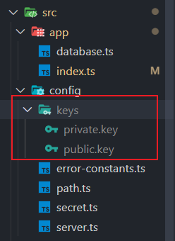

# LyokoHub 

**本项目是非常详细的手把手教你如何结合 ESModule 和 TypeScript ，利用Koa实现的一个基于 NodeJS 开发的后台管理系统平台，该项目结合前端项目[Vue-Admin-Manager-System](https://github.com/Suzumiya-Tiger/Vue-Admin-Manager-System)进行实现。**

通过本项目结合前端项目[Vue-Admin-Manager-System](https://github.com/Suzumiya-Tiger/Vue-Admin-Manager-System)，可以为你建立一套开箱即用的前后端后台管理系统。

本项目接口文档:https://documenter.getpostman.com/view/20140339/2s9Ykt6KK5

## **重大提示**

如果您使用的Node版本是V18.6.0以下，您可以直接使用主分支master的代码。

但是如果您使用最新的Node版本特别是NodeV20.0以上的版本，请务必拉取NodeV20.0分支的代码。

目前最新的Node版本对ts-node的支持存在重大问题，搜遍全网都没有办法解决执行ts-node运行ts文件的坑，详情请看https://github.com/TypeStrong/ts-node/issues/2094，这个issue 从8月开到现在一直都没解决。

如果您有有效的解决方案，恳请您为我提个issue予以解决，感激不尽！

### Node V18.6及以下

采用master分支的代码

主要变化是在package.json中使用ts-node来加载该项目下的typeScript文件 

```javascript
    "dev": "nodemon --watch /src/**/* --delay 500ms -e ts --exec npm start",
    "start": "ts-node --esm -r esbuild-register src/main.ts",
```

### Node V20.0及以上

主要变化是基于NodeV20.0及以上版本在package.json中使用ts-node来加载该项目下的typeScript文件 

```json
    "dev": "nodemon --watch /src/**/* --delay 500ms -e ts --exec npm start",
    "start": "node --loader ts-node/esm -r esbuild-register src/main.ts",
```


## 目录结构

|-- LyokoHub
|-- .env
|-- .eslintrc.js
|-- .gitignore
|-- package.json
|-- pnpm-lock.yaml
|-- readme.md
|-- tsconfig.json
|-- .husky
| |-- pre-commit
| |-- \_
| |-- .gitignore
| |-- husky.sh
|-- src
|-- main.ts
|-- config
| |-- server.ts
|-- router
|-- user.router.ts 

## 必须配置项

### 服务器和mysql数据库配置

请在本地创建*.env*文件，**自主配置相关服务器和mysql配置**，示例文件内容如下：

```js
SERVER_HOST=您的服务器HOST，本地可配置为 http://localhost
SERVER_PORT=您的服务器接口
MYSQL_HOST=您的数据库HOST，本地可配置为 localhost
MYSQL_PORT=您的数据库接口
MYSQL_DATABASE= 您的数据库名称
MYSQL_USER= 您的数据库用户名称
MYSQL_PASSWORD=您的数据库密码
```

### 公私钥的创建

在config文件夹下建立keys文件夹，然后基于openssl生成公钥和私钥，用于给用户登录提供token。

这个操作流程简单来说就是在指定的生成keys的路径下，在命令行输入OPENSSL进入openssl配置模式，然后输入以下命令生成私钥和公钥：

```shell
openssl
> genrsa -out private.key 2048
> rsa -in private.key -pubout -out public.key
```

**请注意在进入OPENSSL配置环境之前，先cd进对应的config目录下的keys文件夹。**



随后我们通过在 *secret.ts*里面导入和导出对应的公钥和私钥文件，以 `fs.readFileSync()`读取对应的文件。

```js
import fs from "fs";
const PRIVATE_KEY = fs.readFileSync("./src/config/keys/private.key");
const PUBLIC_KEY = fs.readFileSync("./src/config/keys/public.key");
export { PRIVATE_KEY, PUBLIC_KEY };
```

## 本项目引用插件

本项目引用插件大多为了实现对ts的良好支持，除了注释规范文件以外其它均以为您做好了配置。您可以在本章节下做一个参考，方便您结合Koa+typescript完成项目的配置支持。

1.利用 husky 和 commitizen 保证项目的注释规范(可选)

`pnpm install commitizen -D`

`pnpx commitizen init cz-conventional-changelog --pnpm --save-dev --save-exact`

2.利用 eslint 规范 typescript 代码(已安装)

`pnpm add@typescript-eslint/eslint-plugin@latest -D`

3.dotenv用于实现全局环境变量的定义和引用(已安装)

4.通过esbuild-register用于在 Node 环境中运行 TypeScript 代码(已安装)

```shell
pnpm i esbuild-register -D
pnpm i @types/koa @types/koa-router @types/koa2-cors @types/koa-bodyparser -D
```

5.在 Koa 中使用 typescript，需要通过安装koa-router实现(已安装)

```shell
pnpm install koa-router
```

此实现用于在 ESModule 中使用 Koa-router。

6.nodemon

使用 nodemon 实时更新 Node 的同步刷新，主要体现在package.json中的dev脚本。

## 登录用户校验

我们在 *公私钥的创建* 栏目已经通过OPENSSL生成了一套公钥和私钥，存放于本地config目录下的keys文件夹，这里的公钥和私钥请您按照说明自行配置。

登录相关的路由配置在 *login.router.ts*中实现，我们通过以下一行代码作为入口，完成用户信息的验证，以及公私钥和颁发和验证：

```js
loginRouter.post("/", verifyLogin, loginController.sign);
```

### 用户信息验证

具体的verifyLogin来自于*login.middleware.ts*的导出，它的具体实现如下：

```js
const verifyLogin = async (ctx: Context, next: Next) => {
  const { name, password } = ctx.request.body as userType;
  // 1.判断相关的数据逻辑(是否已存在/为空/格式问题等等)
  // 1.1判断用户名和密码是否为空
  if (!name || !password) {
    //   记得把ctx传递出去
    return ctx.app.emit("error", NAME_OR_PASSWORD_IS_REQUIRED, ctx);
  }
  // 1.2判断用户名是否已存在
  let user: IUser | null = null;
  const users = await userService.findUserByName(name);
  if (Array.isArray(users) && users.length > 0) {
    user = users[0] as IUser;
  }
  if (!user) {
    return ctx.app.emit("error", NAME_IS_NOT_EXISTS, ctx);
  }
  // 2.查询数据库中的用户密码和用户传递的密码是否一致
  if (user.password !== md5Password(password)) {
    return ctx.app.emit("error", PASSWORD_IS_INCORRENT, ctx);
  }
  // 3.将user信息存入ctx中
  ctx.user = user;
  // 4.验证通过，执行next进入令牌颁发中间件
  // 下一个中间件的职能：颁发令牌，传入token=> 在login.controller.ts中进行验证
  await next();
};
```

1.它会按顺序验证必填的name和password是否正确写入，如果没有写入则通过 

```js
ctx.app.emit("error", NAME_OR_PASSWORD_IS_REQUIRED, ctx);
```

进行错误处理。

2.随后再通过检索数据库是否存在该用户，如果存在则将用户信息存入到 `user`变量里面。

3.随后我们通过 `md5Password(password)`来对客户端传递过来的密码进行md5加密操作，以方便和数据库里面保存的已经过md5加密后的密码进行比对。

4.如果数据库的用户密码和 `user`变量提供的密码相一致，那么将会把`user`信息直接存入`ctx`上下文对象，`ctx.user`是全局共享的，所以我们需要存进 `ctx`以供其它地方使用。

5.再通过`await next()`执行下一个流程——颁发token令牌。

#### MD5加密

我们应该避免密码作为明文进行传输，所以我们这里需要借助 *crypto*插件来完成对密码的md5加密操作，该文件位于utils*下的md5-password.ts*：

```js
import crypto from "crypto";
// md5Password用于对用户密码进行加密
export function md5Password(password: string) {
  const md5 = crypto.createHash("md5");
  const encryptedPassword = md5.update(password).digest("hex");
  return encryptedPassword;
}
```

我们借助 `md5Password(password: string)`函数来完成对密码的加密操作。

我们在创建用户的时候，已经将用户密码经过了md5加密操作，也就是在 *user.router.ts*里面创建用户的请求里面进行了处理：

```js
userRouter.post("/", verifyUser, handlePassword, userController.create);
userRouter.patch("/:userId", verifyUser, userController.update);
```

但是我们需要区分创建用户和更新用户，我们将会在 *user.middleware.ts*这一承担验证和处理数据的“握手”文件里面进行对密码的md5加密工作：

```js
const handlePassword = async (ctx: Context, next: Next) => {
  // 1.取出密码
  const { password } = ctx.request.body as IUser;
  if (!password) {
    await next();
    return;
  }
  // 2.对密码进行加密
  // ctx.request.body.password=加密（password）

  // ctx.request.body的类型是unknown，需要进行属性检测和类型断言
  if (typeof ctx.request.body === "object" && ctx.request.body !== null) {
    // 这一步非常关键，必须检测password是否在ctx.request.body中，否则ts检查会报错
    if ("password" in ctx.request.body) {
      ctx.request.body.password = md5Password(password);
    } else {
      return;
    }
  } else {
    return;
  }
  // 3.执行下一个中间件
  await next();
};
```

后续我们会把经过md5加密的用户密码，和用户名称，用户id等等数据继续传入到数据库的操作之中去，完成用户信息录入操作。

### 颁发token令牌

我们通过 *loginController.sign*来完成token的颁发，token的颁发依赖于第三方插件*jsonwebtoken(jwt)*，所以我们需要进行安装(已安装)和导入操作。

```js
import { Context } from "koa"; // 导入 Context 类型
import jwt from "jsonwebtoken";
import { PRIVATE_KEY } from "../config/secret";
// 该文件用于在登录验证均通过时，颁发令牌
class LoginController {
  // 签发令牌,传入token
  sign(ctx: Context) {
    try {
      // 1.获取用户信息
      const { id, name } = ctx.user;
      // 2.颁发token令牌
      const token = jwt.sign({ id, name }, PRIVATE_KEY, {
        // 令牌有效期为24小时
        expiresIn: 24 * 60 * 60,
        algorithm: "RS256"
      });
      // 3.返回用户信息
      ctx.body = { code: 0, data: { id, name, token } };
    } catch (err) {
      console.log(err);
    }
  }
  test(ctx: Context) {
    ctx.body = "验证身份通过！";
  }
}
const loginController = new LoginController();
export { loginController };

```

我们利用`jwt.sign()`对令牌进行颁发，第一个参数即为payload，也就是用户的id和name，因为此时密码验证已经通过了，所以我们无需在此传入经过md5加密后的密码。

随后我们通过OPENSSL gernrsa所生成的私钥*PRIVATE_KEY*作为*secretKey*传入对应的配置，最后在写入*expiresIn*超时时间的设置，和*algorithm*声明的`RS256`非对称加密。

至此token已经生成成功，并且写入`ctx.body`作为给客户端的回调。

### 验证token

我们统一调用 *login.middleware.ts*文件里面的 `verifyAuth()`来完成对token的调用，`verifyAuth()`多用于各个业务router中作为必须验证token的中间件使用，比如 *role.router.ts*下的roleRouter路由控制器:

```js
import KoaRouter from "koa-router";
import { roleController } from "../controller/role.controller";
import { verifyAuth } from "../middleware/login.middleware";
import { verifyRole } from "../middleware/role.middleware";

const roleRouter = new KoaRouter({ prefix: "/role" });
// 增删改查
roleRouter.post("/", verifyAuth, verifyRole, roleController.create);
roleRouter.delete("/:roleId", verifyAuth, roleController.remove);
......
......

```

我们来看一下 *login.middleware.ts*里面 `verifyAuth()`函数的具体实现：

```js
// //verfityAuth用于验证token的有效性
const verifyAuth = async (ctx: Context, next: Next) => {
  // 1.获取用户传递的token
  const authorization = ctx.headers.authorization;
  // "Bearer "=>切记！！！！！！！这里的Bearer后面有一个空格！！！！！！！
  if (!authorization) {
    return ctx.app.emit("error", UN_AUTHORIZATION, ctx);
  }

  const token = authorization.replace("Bearer ", "");
  // 2.验证token是否有效
  try {
    // 2.1获取token的信息
    const result = jwt.verify(token, PUBLIC_KEY, {
      algorithms: ["RS256"]
    });
    // 2.2将token中被解析出来的用户信息存入ctx中
    ctx.user = result;
    // 3.执行next进入下一个中间件
    await next();
  } catch (error) {
    console.log(error);
    ctx.app.emit("error", UN_AUTHORIZATION, ctx);
  }
};
```

因为我们采用的Autorization验证模式是*bearer token*，所以我们需要去掉对应的键值里面的"bearer"来获取正确的token：

```js
  const token = authorization.replace("Bearer ", "");
```

我们通过 `jwt.verify(token,PUBLIC_KEY,{algorithms:['RS256']})`来验证result是否有效。

我们通过*try catch*来验证对应的验证结果是否有效，如果无效则抛出error并且发射错误信息。

## 项目构建架构

### 目录结构的划分

- 按照功能模块划分
- 安装业务模块划分

### 应用配置信息

- 编写.env文件用于配置mysql和服务器相关信息
- 通过dotenv加载配置的环境变量

### 创建和启动服务器

- 基于koa创建app
- 启动服务器

### 项目入口

项目入口文件位于根目录下的*main.ts*。

我们在这里导入Koa对象和服务器端口的信息，然后导入具体的错误处理模块并且启动错误处理函数。

```js
// 主入口文件应该尽量简约，只负责导入app和启动app

// 导入app
import app from "./app";
import { SERVER_PORT } from "./config/server";
import { setupArrayErrorHandlers, setupErrorHandlers } from "./utils/handle.error";
setupErrorHandlers();
setupArrayErrorHandlers();
// 启动app
app.listen(SERVER_PORT, () => {
  console.log("服务器启动成功");
});

```

我们通过主入口文件启动Koa以开启整个服务器。

#### App=>Koa

Koa的启动建立在app文件夹下的*index.js*，我们在这里引入Koa，并且通过 `new Koa()`建立Koa的实例对象。

利用Koa的第三方插件*koa-bodyparser*，通过 `app.use(bodyParser())`注册能够自动解析`ctx.request.body`并完成`JSON.parse()`的转化解析操作。

后面通过一个自动化脚本 `registerRouter(app)`来完成了对所有路由的自动化注册。

```js
// 必须安装koa-router
// 常规的基于commonJS的koa插件不能直接运行 ts 代码，所以需要额外的插件。在这里，我们将用到 esbuild-register 运行 TS 代码。
// 必须安装@types/koa @types/koa-router @types/koa2-cors @types/koa-bodyparser 使得可以在Koa中使用TS
import Koa from "koa";
import bodyParser from "koa-bodyparser";
import registerRouter from "../router";
// 1.创建app
const app = new Koa();

// 2.对app使用中间件
// bodyParser必须要在router之前使用
// bodyParser可以将post请求的数据解析到ctx.request.body中
app.use(bodyParser());
registerRouter(app);

// 3.导出app
export default app;

```

### router

注册KoaRouter，构建Koa的路由组件并且写入各个中间件，确保路由组件的执行顺序。 

### controller

构建路由组件中定义的中间件并且执行中间件的具体内容，通过一个Class类封装具体的执行函数，并利用上下文Context执行回执，这是路由组件中的具体执行步骤。

### middleware

在执行controller中定义中间件之前，需要在此模块中构建具体的逻辑验证函数，并且加以执行，在验证通过后通过next()继续执行后面的中间件组件(controller)。

### service

本文件是为了建立数据库和数据的连接使用，将服务器和客户端之间来往的数据通过该模块进行数据库的交互操作，操作数据库由service编写。

## 数据库连接操作

数据库连接操作由mysql2来完成，它主要实现两个功能：

- 创建数据库连接(通过连接池实现)
- 测试数据库连接是否成功

## 错误处理

错误处理的常量统一建立在config*文件夹下的error-constants.ts*，在这个文件中我们对错误处理的常量语句进行统一定义和导出操作。

### 启动错误响应

我们在utils目录下的*handle.error.ts*统一管理错误回调，首先我们需要导入所有的错误常量，然后通过`app.on('error',回调)`监听由`ctx.app.emit('error',错误常量名称,ctx)`在全局各种位置所发射的错误处理事件。

```js
export function setupErrorHandlers() {
  // app.on的事件监听器是非常灵活的，可以在其他的中间件通过ctx.app.emit触发，
  // 然后在这里接收到事件，然后做相应的处理
  app.on("error", (error, ctx) => {
    let code = 0;
    let message = "";
    switch (error) {
      case NAME_OR_PASSWORD_IS_REQUIRED:
        code = -1001;
        message = "用户名或者密码不能为空";
        break;
      case NAME_IS_ALREADY_EXISTS:
        code = -1002;
        message = "该名称已存在,无法注册";
        break;
      case NAME_IS_NOT_EXISTS:
        code = -1003;
        message = "登录的用户名不存在，请检查您的用户名";
        break;
      case PASSWORD_IS_INCORRENT:
        code = -1004;
        message = "密码错误，请重新输入";
        break;
      case UN_AUTHORIZATION:
        code = -1005;
        message = "无效的token";
        break;
      case OPERATION_IS_NOT_PERMITTED:
        code = -1006;
        message = "您没有权限进行此操作";
        break;
      case DATA_IS_NOT_EXIST:
        code = -1007;
        message = "您操作的该条数据不存在";
        break;

      case LABEL_IS_NOT_EXIST:
        code = -1009;
        message = "请输入正确的标签名称";
        break;
      case ROLENAME_IS_ALREADY_EXISTS:
        code = -1010;
        message = "角色名已存在,无法注册";
        break;
      case ROLENAME_IS_REQUIRED:
        code = -1011;
        message = "角色名不能为空";
        break;

      case SUEPER_USER_CAN_NOT_BE_DELETED:
        code = -1012;
        message = "超级管理员不能被删除";
        break;
      case NAME_IS_REQUIRED:
        code = -1013;
        message = "该名称不能为空";
        break;
      case FORBIDDEN_DELETE:
        code = -1014;
        message = "此项受保护，不可删除";
        break;
      case NO_PERMISSION_TO_OPERATE:
        code = -1015;
        message = "非管理员用户不可进行此项受保护数据的操作";
        break;
    }
    ctx.body = { code, message };
  });
}
export function setupArrayErrorHandlers() {
  app.on("arrayError", (error, ctx) => {
    let code = 0;
    let message = "";
    switch (error[0]) {
      case LABEL_IS_ALREADY_EXISTS:
        code = -1008;
        message = `标签${error[1]}已存在,无法注册`;
        break;
    }
    ctx.body = { code, message };
  });
}
```

这些错误处理的回调函数通过在主入口文件 *main.ts*中调用，全称保持活跃状态，随时监听全局发射过来的错误事件。

随后我们通过在发射事件中一同发射过来的`ctx`，通过 `ctx.body`返回错误相应数据给客户端，即可完成完成错误处理。

注意理解一下Koa中 `ctx`所发挥的巨大作用，`ctx`是渗透到全局的基于koa中间件所建立的上下文对象，只要是调用了KoaRouter的methods请求的第二个参数及后续参数，都是一个携带ctx和next的中间件，我们可以巧妙地借用这些中间件回调来完成 `ctx`的传递。
